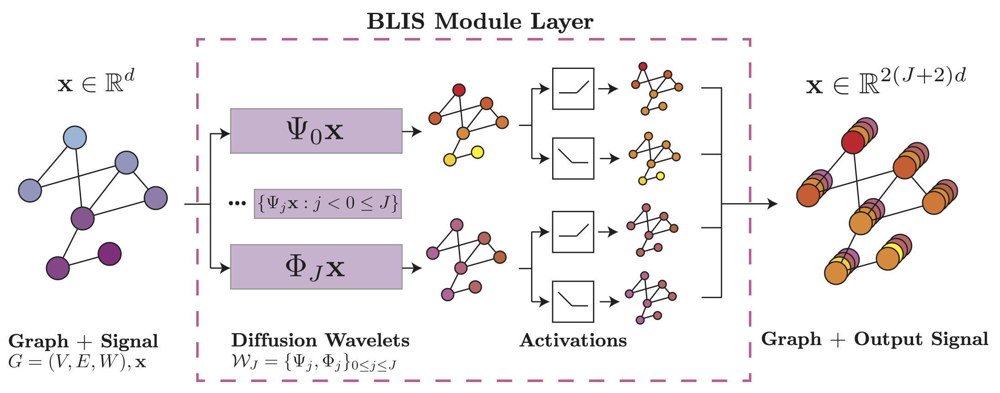

# BLIS-Net: Classifying and Analyzing Signals on Graphs
BLIS-Net (bi-Lipschitz Scattering Network) is a provably powerful GNN designed for graph signal classification. For further details, please refer to our AISTATS 2024 [paper](https://proceedings.mlr.press/v238/xu24c.html). 

## Introduction

BLIS-Net consists of four modules/layers: 
1. The BLIS-Module
2. Moment aggregation module
3. Embedding/dimensionality reduction layer
4. Classification layer

To accommodate a variety of workflows and tasks, we provide two equivalent implementations of the modules of BLIS-Net. 

The first implementation is a pytorch implementation (code [here](blis/models/blis_legs_layer.py)). BLIS-Module outputs scattering features on each node, and may thus be considered as a form of message passing. This implementation may be flexibly incorporated into GNN architectures for a variety of downstream tasks. An example implentation is given in the BlisNet class from [blis_legs_layer.py](blis/models/blis_legs_layer.py). 

The first implementation utilizes numpy to compute the scattering moments and write them to memory (code [here](blis/models/scattering_transform.py)), after which a variety  of classifiers may be trained on top of the computed scattering moments (code [here](scripts/classify_scattering.py)). 

## Installation

Create a conda environment

~~~
conda create -n blis python=3.9`
conda activate blis
cd blis
pip install -e .
~~~
note: it may also be necessary to install [torch-scatter](https://github.com/rusty1s/pytorch_scatter)

### Data download (optional)
The data used in the paper may be downloaded from the following [link](https://drive.google.com/file/d/1zMItIcmXFbN66sEZOPql30dKgxPFo5_v/view?usp=sharing).
Please download the zip into the main project directory data directory, perhaps following something like:
~~~
rm -rf data
unzip data.zip
mv data_export data
rm data.zip
~~~

## Quick Start

### Pytorch implementation

A script to run the pytorch implementation is provided in scripts. From the main directory, run:
~~~
python scripts/classify_torch.py --model BlisNet --dataset synthetic --sub_dataset gaussian_pm --task_type PLUSMINUS
~~~

### Numpy implementation

One script is used to first compute scattering coefficients and a second one is used to train a variety of classifiers on them. For example, one might run:
~~~
python scripts/calculate_scattering.py --scattering_type blis --wavelet_type W2 --largest_scale 4 --highest_moment 3 --dataset traffic --sub_dataset PEMS08
python scripts/classify_scattering.py --dataset=traffic --largest_scale=4 --sub_dataset=PEMS08 --scattering_type=blis --task_type=DAY --moment_list 1 --layer_list 1 2 3 --model SVC
~~~

### Help

If you have any questions or require assistance using BLIS-Net, please contact us at <https://krishnaswamylab.org/contact>.

